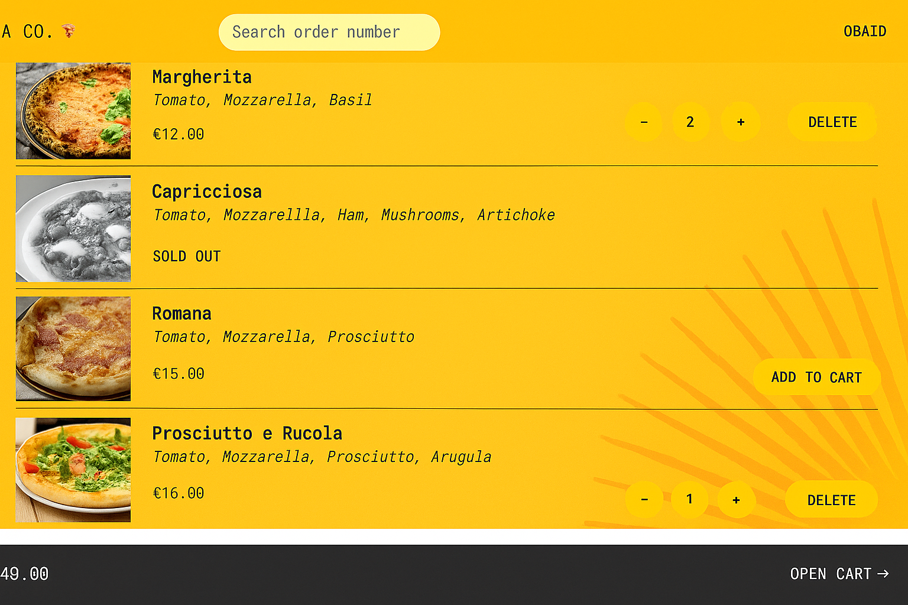

<h1 align="center">🍕 Fast React Pizza </h1>

<div align="center">
  <a href="https://zafast-pizza.netlify.app" target="_blank">
    
  </a>
</div>

---

## 🚀 Project Overview

**Fast React Pizza** is a sleek and dynamic web application where users can order one or more delicious pizzas from a customizable menu. Built with **React**, **Redux Toolkit**, **Tailwind CSS**, and powered by **Vite**, the app provides a fast and responsive user experience.

---

## Key Features

- 🍕 Order one or multiple pizzas from a dynamic API-driven menu
- No authentication required — users just input their **name**, **phone**, and **address**
- Add multiple pizzas to a **cart** and place an order
- ⏱️ **Mark orders as priority** to speed up delivery (adds 20% to the price)
- 🗺️ Users can **use geolocation** to autofill their delivery address
- Orders receive a **unique ID** that users can use to **track them**
- Update an existing order to **priority** even after placing it
---

## 📚 What I Learned

This project helped reinforce core concepts of modern frontend development, including:

- Setting up a performant development workflow with **Vite**
- Writing **scalable React code** with modular components and reusable hooks
- Managing complex global state using **Redux Toolkit**
- Styling efficiently using **Tailwind CSS**
- Handling async data fetching, API integration, and real-time updates with client-side routing.
- Managing **map interactions**, geolocation, and user-friendly UX patterns

---

## Installation

1. Clone the project:
```bash
git clone https://github.com/YourUsername/fast-react-pizza-co.git
cd fast-react-pizza-co
```

2. Install dependencies:
```bash
npm install
```

3. Run dev-server:
```bash
npm run dev
```

## Credits

This app is based on the udemy course [The Ultimate React Course 2025: React, Redux & More](https://www.udemy.com/course/the-ultimate-react-course) by [Jonas Schmedtmann](https://twitter.com/jonasschmedtman).

Special thanks to Jonas for his excellent teaching and guidance throughout the course.